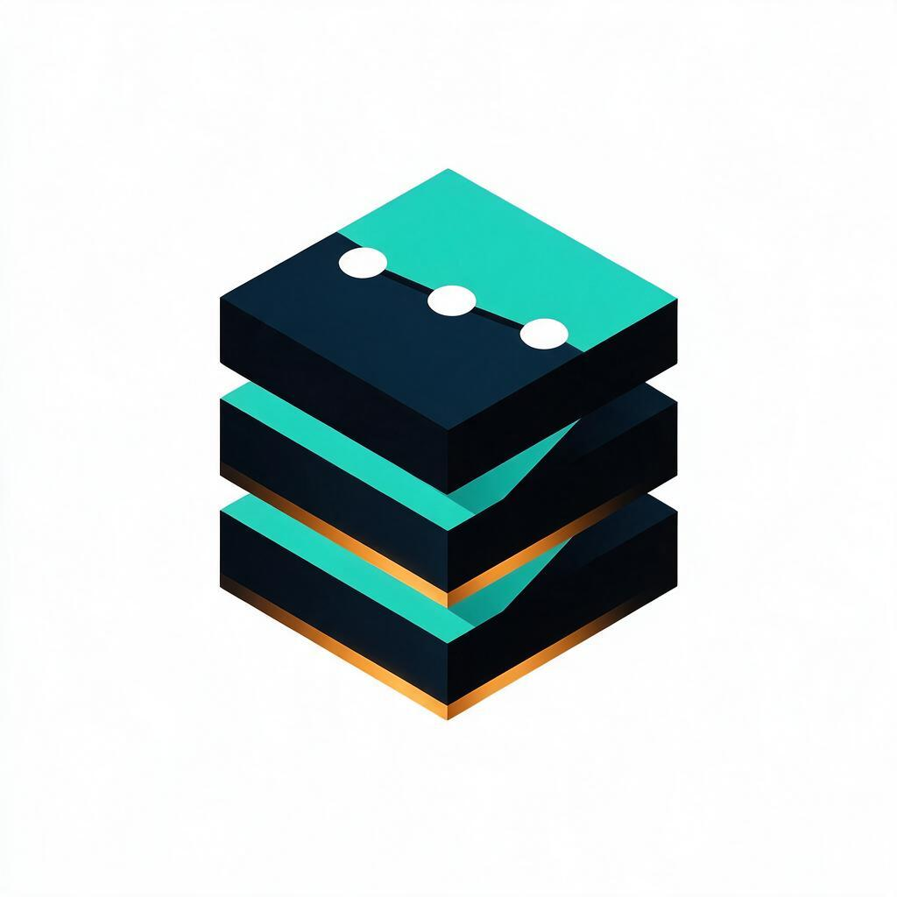

<p align="center">
  
</p>
<p align="center">
  <strong>Strata</strong>
</p>
<p align="center">
  <strong>Validate your understanding. Learn at your level. Track your progress — with evidence, not vibes.</strong>
</p>
<p align="center">
  <a href="#license"></a>
  <a href="https://github.com/trac41799/strata-knowledge/actions/workflows/ci.yml"></a>
  <a href="https://github.com/trac41799/strata-knowledge/stargazers"></a>
  <a href="https://github.com/trac41799/strata-knowledge/issues"></a>
  <a href="#license"></a>
  
  <br>
  
</p>

<br>

## ✨ Overview

Strata is a **standards-grounded knowledge base** for software engineering — from system
design down to hardware — wrapped in an **agent harness**. Point any coding agent at this
repo and it will validate your mental models against authoritative content, teach you at
your measured level, and log your learning journey locally.

Every claim carries an **evidence tier** (`T0` proof → `T4` frontier) and a citation
record; every topic ships a **Bloom-tagged validation kit** and a **spaced-repetition
review schedule**; your journey data stays **on your machine**.

- **Industry-grounded, not blog-grade.** Content is mapped to SWEBOK v4.0, CS2023,
  ISO/IEC 25010:2023, ISO/IEC/IEEE 12207, and CMMI V3.0 — audited against them in the
  [coverage report](docs/coverage-report.md).
- **Scientifically proven learning.** Retrieval practice, distributed practice, and
  interleaving (Dunlosky et al. 2013; Cepeda et al. 2006) are baked into every pack.
- **Honest provenance.** A claim without a record is forbidden (CI-enforced); frontier
  content is dated, flagged volatile, and expires for re-review.
- **Private by default.** Profile, skill matrix, and session log live in a local
  `.journey/` — gitignored, schema-validated, never uploaded.

## 🚀 Features

<table>
<tr>
<td width="33%">

### 🎯 Claim Validation
State a mental model in plain language; the agent returns a verdict
(`correct | partial | incorrect`) with evidence tiers, `S-####` citations, and a
corrected model — from [11 copy-paste prompts](harness/prompts/).

</td>
<td width="33%">

### 🧠 Evidence-Tiered Knowledge
68 topics on 4 axes (band · track · tier · bloom) form a prerequisite graph;
every claim tagged `[T0..T4]` + record, 200+ verified citations, CI-enforced
claim↔record bijection.

</td>
<td width="33%">

### 📚 Spaced-Retrieval Learning
Every topic ships a validation kit (formative/summative/review banks at Bloom
levels) and a spaced ladder (1/3/7/14/30/60/120 days) with calibration tracking
of predicted vs actual.

</td>
</tr>
<tr>
<td>

### 🤖 Agent-Agnostic Harness
Works with Claude Code, opencode, Cursor, Codex, Gemini CLI and more — any agent
that reads [`AGENTS.md`](AGENTS.md). Progressive-disclosure maps keep agent
context budgets flat.

</td>
<td>

### 🔍 Standards Coverage Maps
[`standards/`](standards/) maps the knowledge base against SWEBOK v4.0 (18 KAs),
CS2023 (17 KAs), ISO 25010:2023, CMMI V3.0 and ISO 12207 — with a live
[coverage report](docs/coverage-report.md) as the roadmap.

</td>
<td>

### 🛡️ Local-First Journey
[`.journey/`](journey/README.md) holds your profile, skill matrix, review queue,
and event log — gitignored, schema-validated by
[`tools/validate-journey.py`](tools/validate-journey.py). Nothing leaves your machine.

</td>
</tr>
</table>

## ⚡ Quick Start

1. **Clone and point your coding agent at the repo** (as its working directory)
   ```bash
   git clone https://github.com/trac41799/strata-knowledge.git
   cd strata-knowledge
   ```
2. **Paste a prompt from [`harness/prompts/`](harness/prompts/)** — e.g. validate a claim:
   ```
   I want to validate my understanding of systems-software/http-caching.
   My claim: "Cache-Control: no-cache means the response must not be stored."
   Follow AGENTS.md and give me a verdict with tiers, evidence records, and the
   corrected model. Schedule my spaced review and log the session (ask first).
   ```
3. **Learn a topic** — [`teach-topic.md`](harness/prompts/teach-topic.md) · [`quiz-me.md`](harness/prompts/quiz-me.md) · [`explain-back.md`](harness/prompts/explain-back.md)
4. **Plan a curriculum** — [`plan-curriculum.md`](harness/prompts/plan-curriculum.md) (topological path from your skill matrix to any target topic)
5. **Review your work** — [`review-project.md`](harness/prompts/review-project.md) against standards-mapped rubrics
6. **Track it all** — every session is logged to `.journey/` per the committed schemas

## 🧩 Supported Agents

| Agent | Memory file | Notes |
|---|---|---|
| **Claude Code** | `CLAUDE.md` | reads AGENTS.md first |
| **opencode** | `.opencode/memory/` | AGENTS.md-aware |
| **Cursor** | `.cursor/rules` | paste any prompt |
| **Codex CLI** | `AGENTS.md` | native |
| **Gemini CLI** | `GEMINI.md` | reads AGENTS.md first |
| **Aider / Goose / Cline** | `CONVENTIONS.md` / `.goose/` / `.clinerules` | paste any prompt |

## 🏗️ Architecture

```
knowledge/<track>/<topic>/   topic packs: concept.md (tagged claims),
                             validation.md (Bloom-tagged items),
                             teaching.md (examples, misconceptions)
evidence/records/            one file per cited source (S-####)
standards/                   SWEBOK / CS2023 / ISO / CMMI coverage maps
journey/                     committed conventions: schemas, templates, privacy
.journey/                    YOUR local learning data (gitignored, private)
harness/                     AGENTS.md contract + 11 copy-paste prompts
rubrics/                     standards-mapped project-review rubrics
tools/                       stdlib-only validation pipeline (lint, graph, coverage)
docs/                        spec, plan, ADRs, design system, UI spec, reviews
ui/                          journey-interface design system + explorations
```

Four layers: **Knowledge** (facts with provenance) → **Validation** (proving
understanding) → **Journey** (private progress) → **Harness** (how any agent behaves).
Topics form a DAG; learning paths and build waves follow its topological order —
[`knowledge-graph.yml`](knowledge-graph.yml) · [`INDEX.md`](INDEX.md).

## 💻 Development

- [Docs](docs/spec.md) — full specification · [Plan](docs/plan.md) — roadmap ·
  [PRINCIPLES.md](PRINCIPLES.md) — axioms (K0–K6, T1)
- Gates (stdlib-only, CI-enforced):
  ```bash
  python tools/lint.py && python tools/check-graph.py && python tools/index.py && python tools/coverage.py
  ```
- Contribution flow: see [CONTRIBUTING.md](CONTRIBUTING.md)

## 🤝 Contributing

Contributions welcome — this is a knowledge commons. PR flow: draft → CI → human
review, per [CONTRIBUTING.md](CONTRIBUTING.md). The [coverage report](docs/coverage-report.md)
is your roadmap. Governed by the [Code of Conduct](CODE_OF_CONDUCT.md).

## 🗺️ Roadmap

- **56/68 topics published** across 12 tracks; wave 4 = remaining 12 scaffolds
- Journey Interface implementation (design ready: [design system](docs/design-system/),
  [UI spec](docs/spec-ui.md), [TDD plan](docs/plan-ui.md))
- Agent-context MCP server (optional machinery)

## 📄 License

- **Knowledge, docs, and content:** [CC BY 4.0](LICENSE) — share and adapt with attribution.
- **Tooling and code:** [MIT](LICENSE-CODE).

Copyright (c) 2026 Strata contributors.
